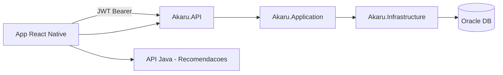

# Akaru API — .NET

API REST do projeto **Akaru** (FIAP Global Solution 2026/1) — plataforma de apoio ao agronegócio com dados de clima, culturas e recomendações de plantio.

**Disciplina:** Advanced Business Development with .NET  
**Repositório:** https://github.com/juanxto/AkaruAPI

## Equipe Akaru

| Integrante | RM | Papel |
|------------|-----|-------|
| Juan Pablo Rebelo Coelho | RM560445 | API .NET (este repositório) |
| Luann Noqueli Klochko | RM560313 | App React Native |
| Victor Rodrigues De Lima Lourenço | RM560087 | API Java + Gemini |
| Lucas Higuti Fontanezi | RM561120 | Oracle PL/SQL |
| Renato Silva Alexandre Bezerra | RM560928 | Arquitetura + IA |

## Vídeos

- **Pitch (3 min):** https://youtu.be/wtwuiYfW88M
- **Demonstração (8 min):** https://youtu.be/n53ZO3xE3OQ

## Problema e solução

O **Akaru** conecta agricultores a recomendações inteligentes de plantio usando dados climáticos e catálogo de culturas. Esta API .NET é responsável pela **gestão de dados persistentes**:

- Cadastro e autenticação de usuários (JWT)
- CRUD de **plantios** do agricultor
- **Histórico** de recomendações vindas da API Java

## Arquitetura



### Clean Architecture

```
src/
├── Akaru.Domain/          # Entidades e exceções
├── Akaru.Application/     # Serviços, DTOs, interfaces
├── Akaru.Infrastructure/  # EF Core Oracle, repositórios
└── Akaru.API/             # Controllers, JWT, middleware, Swagger
tests/
└── Akaru.Tests/           # Testes unitários e de integração (xUnit + AAA)
```

| Camada | Responsabilidade |
|--------|------------------|
| **Domain** | Entidades (`Usuario`, `Plantio`, `HistoricoRecomendacao`) |
| **Application** | Regras de negócio, DTOs, serviços |
| **Infrastructure** | EF Core Oracle, repositórios concretos |
| **API** | Controllers REST, autenticação JWT, Swagger |

### Relacionamentos (Oracle)

- `Usuario` 1:N `Plantio`
- `Usuario` 1:N `HistoricoRecomendacao`
- `Plantio` N:N `Cultura` (via `TB_PLANTIO_CULTURA`)

Diagrama detalhado: [`docs/architecture.md`](docs/architecture.md)

## Stack

- ASP.NET Core 8
- Entity Framework Core + Oracle
- JWT Bearer Authentication
- Swagger/OpenAPI
- xUnit + Moq (testes AAA)
- Docker (Oracle XE)

## Pré-requisitos

- [.NET 8 SDK](https://dotnet.microsoft.com/download)
- [Docker Desktop](https://www.docker.com/products/docker-desktop/) (Oracle via container)

## Instalação e execução

### 1. Subir o banco Oracle

```powershell
.\scripts\setup-banco.ps1
```

Ou manualmente:

```powershell
docker compose up -d
```

### 2. Configurar ambiente

```powershell
copy src\Akaru.API\appsettings.Development.json.example src\Akaru.API\appsettings.Development.json
```

Ajuste a connection string Oracle se necessário.

### 3. Executar a API

```powershell
cd src\Akaru.API
dotnet run
```

| Recurso | URL |
|---------|-----|
| Swagger | http://localhost:5001/swagger |
| Health Check | http://localhost:5001/health |

## Autenticação JWT

Todas as rotas protegidas exigem:

```
Authorization: Bearer <jwt_token>
```

### Fluxo

1. `POST /api/auth/register` — cadastro (retorna JWT)
2. `POST /api/auth/login` — login (retorna JWT)
3. Demais endpoints com o token no header

### Exemplo — Cadastro

```http
POST /api/auth/register
Content-Type: application/json

{
  "nome": "Juan Pablo",
  "email": "juan@email.com",
  "senha": "senha123"
}
```

**Response 201:**
```json
{
  "token": "eyJhbGciOiJIUzI1NiIs...",
  "expiraEm": "2026-06-09T12:00:00Z",
  "usuario": {
    "id": 1,
    "nome": "Juan Pablo",
    "email": "juan@email.com",
    "latitude": null,
    "longitude": null,
    "cidade": null,
    "estado": null,
    "dataCadastro": "2026-06-08T12:00:00Z"
  }
}
```

### Exemplo — Login

```http
POST /api/auth/login
Content-Type: application/json

{
  "email": "joao@email.com",
  "senha": "senha123"
}
```

Usuários do banco GS (Lucas) podem logar com senha em texto do seed (`senha123`).

## Endpoints

| Método | Rota | Auth | Descrição |
|--------|------|------|-----------|
| POST | `/api/auth/register` | Não | Cadastro + JWT |
| POST | `/api/auth/login` | Não | Login + JWT |
| GET | `/api/usuarios/me` | JWT | Perfil do usuário |
| PUT | `/api/usuarios/me` | JWT | Atualizar perfil |
| POST | `/api/plantios` | JWT | Registrar plantio |
| GET | `/api/plantios` | JWT | Listar plantios |
| GET | `/api/plantios/{id}` | JWT | Obter plantio |
| PUT | `/api/plantios/{id}` | JWT | Atualizar plantio |
| DELETE | `/api/plantios/{id}` | JWT | Remover plantio |
| POST | `/api/historico` | JWT | Salvar recomendação |
| GET | `/api/historico` | JWT | Listar histórico |
| GET | `/health` | Não | Health check |

Arquivo de testes manuais: [`src/Akaru.API/Akaru.API.http`](src/Akaru.API/Akaru.API.http)

### Exemplo — Plantio

```http
POST /api/plantios
Authorization: Bearer {jwt_token}
Content-Type: application/json

{
  "culturaId": 3,
  "latitude": -23.5505,
  "longitude": -46.6333,
  "dataPlantio": "2026-06-15T00:00:00Z",
  "detalhes": "Solo argiloso, 2 hectares",
  "cidade": "São Paulo",
  "estado": "SP"
}
```

### Exemplo — Histórico

```http
POST /api/historico
Authorization: Bearer {jwt_token}
Content-Type: application/json

{
  "culturaId": 3,
  "culturaNome": "Milho",
  "textoRecomendacao": "Plante entre setembro e novembro...",
  "score": 87.5,
  "latitude": -23.5505,
  "longitude": -46.6333,
  "detalhes": "Área irrigada"
}
```

## Health Check e monitoramento

O endpoint `/health` verifica:

- API em execução
- Conectividade com o banco Oracle (EF Core)

```powershell
curl http://localhost:5001/health
# Resposta: Healthy
```

Em caso de falha no Oracle, retorna `Unhealthy` com detalhes no corpo da resposta.

## Testes automatizados

Projeto de testes com **xUnit**, padrão **AAA** (Arrange, Act, Assert), **Moq** para mocks e **WebApplicationFactory** para testes de integração.

```powershell
# Todos os testes
dotnet test

# Ou via script
.\scripts\run-tests.ps1
```

### Estrutura dos testes

```
tests/Akaru.Tests/
├── Services/           # Testes unitários (Application)
│   ├── AuthServiceTests.cs
│   ├── PlantioServiceTests.cs
│   ├── UsuarioServiceTests.cs
│   └── HistoricoServiceTests.cs
└── Integration/        # Testes de integração (API HTTP)
    ├── AkaruApiFactory.cs
    └── ApiIntegrationTests.cs
```

### Teste manual do fluxo completo

```powershell
.\scripts\testar-api.ps1
```

Requer API rodando em `http://localhost:5001`.

## Migrations EF Core

```powershell
cd src\Akaru.API
dotnet ef database update --project ../Akaru.Infrastructure
```

Migrations versionadas em `src/Akaru.Infrastructure/Migrations/`.

## CORS

Configurado para aceitar requisições do app mobile (`AllowAnyOrigin` em desenvolvimento).

## Tratamento de erros

Respostas padronizadas:

```json
{
  "erro": true,
  "mensagem": "Descrição do erro",
  "status": 400,
  "timestamp": "2026-06-08T12:00:00Z"
}
```