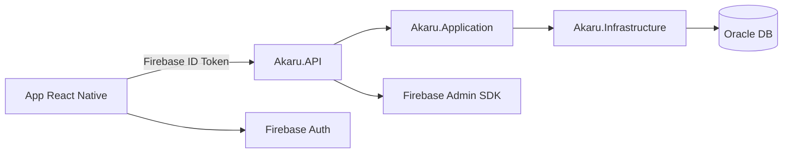

# Arquitetura — Akaru API (.NET)

**Integrante:** Juan Pablo Rebelo Coelho  
**Disciplina:** Advanced Business Development with .NET  
**Projeto:** Akaru — FIAP Global Solution 2026/1

## Visão geral

A API .NET é responsável pela **gestão de dados persistentes** do Akaru:

- Sincronização de usuários autenticados via **Firebase Authentication**
- CRUD de **plantios** registrados pelo agricultor
- **Histórico** de recomendações geradas pela API Java (Gemini)



## Clean Architecture

| Camada | Responsabilidade |
|--------|------------------|
| **Domain** | Entidades, exceções de domínio |
| **Application** | DTOs, interfaces, serviços (regras de negócio) |
| **Infrastructure** | EF Core Oracle, repositórios, Firebase Admin |
| **API** | Controllers, middleware, autenticação, Swagger |

### SOLID aplicado

- **SRP:** cada serviço (`UsuarioService`, `PlantioService`, `HistoricoService`) tem uma responsabilidade
- **DIP:** serviços dependem de interfaces (`IPlantioRepository`, etc.), não de implementações concretas

## Autenticação (Firebase)

O mobile faz login/cadastro no **Firebase Auth** e envia o ID Token:

```
Authorization: Bearer <firebase_id_token>
```

Fluxo:

1. `FirebaseAuthenticationHandler` extrai o token do header
2. `FirebaseAuthService` valida via Firebase Admin SDK
3. Claims `uid` e `email` são injetados no `HttpContext`
4. `POST /api/usuarios/sync` cria o usuário no Oracle na primeira vez

> Em desenvolvimento, `Firebase:UseMockAuth=true` permite testar sem credenciais Firebase.

## Endpoints

| Método | Rota | Descrição |
|--------|------|-----------|
| POST | `/api/usuarios/sync` | Sincroniza usuário Firebase → Oracle |
| GET | `/api/usuarios/me` | Perfil do usuário logado |
| PUT | `/api/usuarios/me` | Atualiza perfil |
| POST | `/api/plantios` | Registra plantio |
| GET | `/api/plantios` | Lista plantios do usuário |
| GET | `/api/plantios/{id}` | Detalhe do plantio |
| PUT | `/api/plantios/{id}` | Atualiza plantio |
| DELETE | `/api/plantios/{id}` | Remove plantio |
| POST | `/api/historico` | Salva recomendação |
| GET | `/api/historico` | Lista histórico |
| GET | `/api/historico/{id}` | Detalhe da recomendação |

## Relacionamentos no banco

- **1:N** — `TB_USUARIO` → `TB_PLANTIO`
- **1:N** — `TB_USUARIO` → `TB_HISTORICO_RECOMENDACAO`
- **N:N** — `TB_PLANTIO` ↔ culturas via `TB_PLANTIO_CULTURA`

## Health Checks

- `GET /health` — verifica API + conexão Oracle via EF Core

## Integração com o mobile (Luann)

Base URL sugerida em desenvolvimento: `http://localhost:5001`

O app deve chamar `POST /api/usuarios/sync` logo após o login Firebase para garantir que o usuário existe no Oracle antes de usar plantios e histórico.
